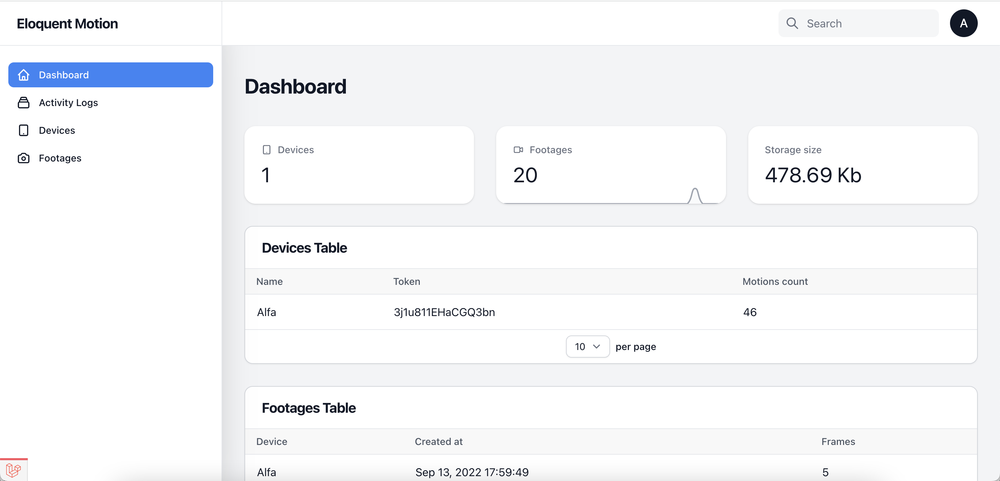

# EloquentSurveillance for Arduino

EloquentSurveillance is an Arduino library that makes it a breeze to integrate
pure video motion detection (**whitout pir!**) in your project.

It comes with batteries included:

 - easy camera configuration
 - HTTP streaming server
 - HTTP file browser
 - Motion detection
 - SPIFFS / SD file storage
 - Telegram notifications

Every feature have been carefully designed to be as easy to use as possible, 
often requiring only 2-3 lines of code.

## A complete motion dashboard

Motion detection is only the beginning. EloquentSurveillance comes with a **fully-featured admin dashboard**
to manage your motion events.

It stores your motion pictures and delivers notifications to many channels:

 - Telegram
 - Email
 - Web push
 - Slack
 - Webhook



Go check it out at [the Eloquent Motion website](https://motion.eloquentarduin.com).


## Motion Detection Example

The following sketch performs basic motion detection.
You can then perform the action you prefer based on the detection result.

```cpp
#define VERBOSE
#include "EloquentSurveillance.h"


EloquentSurveillance::Motion motion;


/**
 *
 */
void setup() {
    Serial.begin(115200);
    delay(3000);
    debug("INFO", "Init");

    // configure camera
    camera.m5wide();
    camera.qvga();
    camera.highQuality();

    // configure motion detection
    //  > setMinChanges accepts a number from 0 to 1 (percent) or an integer
    //    At least the given number of pixels must change from one frame to the next
    //    to trigger the motion
    motion.setMinChanges(0.1);
    //  > setMinPixelDiff accepts an integer
    //    Each pixel value must differ at least of the given amount from one frame to the next
    //    to trigger the motion
    motion.setMinPixelDiff(10);
    //  > setMinSizeDiff accepts a number from 0 to 1 (percent) or an integer
    //    The filesize of one frame from the next must change of at least the given amount
    //    to check for motion
    motion.setMinSizeDiff(0.05);

    while (!camera.begin())
        debug("ERROR", camera.getErrorMessage());
    
    debug("SUCCESS", "Camera is initalized");
}

/**
 *
 */
void loop() {
    if (!camera.capture()) {
        debug("ERROR", camera.getErrorMessage());
        return;
    }

    if (motion.update()) {
        debug("INFO", String("Motion detected in ") + motion.getExecutionTimeInMicros() + " us");
    }
}
```

## Motion Detection to Telegram Example

The following sketch sends a notification to Telegram when motion is detected.

```cpp
#define VERBOSE

#include "EloquentSurveillance.h"
#include "TelegramChat.h"

#define WIFI_SSID "Abc"
#define WIFI_PASS "12345678"
#define BOT_TOKEN "XXXXXXXXXX:yyyyyyyyyyyyyyyyyyyyyyyyyyyyyyyyyyy"
#define CHAT_ID 1234567890

EloquentSurveillance::Motion motion;
EloquentSurveillance::TelegramChat chat(BOT_TOKEN, CHAT_ID);


/**
 *
 */
void setup() {
    Serial.begin(115200);
    delay(3000);
    debug("INFO", "Init");

    // configure camera
    camera.m5wide();
    camera.vga();
    camera.highQuality();

    // configure motion detection
    motion.setMinChanges(0.05);
    motion.setMinPixelDiff(7);
    motion.setMinSizeDiff(100);

    while (!camera.begin())
        debug("ERROR", camera.getErrorMessage());

    while (!connectToWiFi(WIFI_SSID, WIFI_PASS))
        debug("ERROR", "Cannot connect to WiFi");

    debug("SUCCESS", "Camera OK, WiFi connected");
}

/**
 *
 */
void loop() {
    if (!camera.capture()) {
        debug("ERROR", camera.getErrorMessage());
        return;
    }

    if (motion.update()) {
        debug("INFO", String("Motion detected in ") + motion.getExecutionTimeInMicros() + " us");

        bool messageResponse = chat.sendMessage("Motion");
        debug("TELEGRAM MSG", messageResponse ? "OK" : "ERR");

        bool photoResponse = chat.sendPhoto();
        debug("TELEGRAM PHOTO", photoResponse ? "OK" : "ERR");
    }
}
```